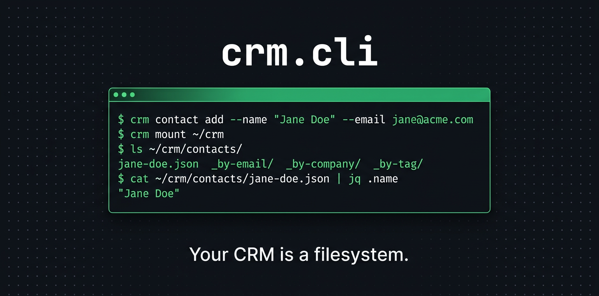

# crm.cli



**A headless, CLI-first CRM for developers who do sales.** Contacts, deals, and pipeline in a single SQLite file — queryable from your terminal, composable with Unix tools, and mountable as a virtual filesystem so any tool that reads files (Claude Code, Codex, grep, jq, vim) has full CRM access without any integration.

No server. No Docker. No accounts. No GUI. Just `bun install -g @dzhng/crm.cli` and go.

> **Sponsored by [Duet](https://duet.so)** — a cloud agent workspace with persistent AI. Set up crm.cli in your own private cloud computer and run it with Claude Code or Codex — no local setup required. [Try Duet &rarr;](https://duet.so)

## Why crm.cli

Existing CRMs are GUI-first tools built for sales teams. If you're a technical founder, indie hacker, or engineer running BD, you're probably managing contacts in a spreadsheet you grep through. crm.cli is built for you.

**Your CRM is a filesystem.** Mount it with `crm mount ~/crm` and every tool that reads files — AI agents, shell scripts, editors — gets full CRM access for free. No MCP servers, no API keys, no integration code. The filesystem is the universal API.

```bash
crm mount ~/crm
ls ~/crm/contacts/
cat ~/crm/contacts/jane-doe.json | jq .name
# Point Claude Code at ~/crm and ask it to research your pipeline
```

**Deep data normalization.** A CSV has zero setup cost. crm.cli justifies its existence with structured intelligence: E.164 phone normalization (look up by any format), website normalization, social handle extraction (paste a LinkedIn URL, it stores the handle), entity merge with reference relinking, and fuzzy duplicate detection. This is what a spreadsheet can never provide.

```bash
crm contact add --name "Jane Doe" \
  --email jane@acme.com \
  --phone "+1-212-555-1234" \
  --linkedin linkedin.com/in/janedoe \
  --company Acme
# Phone stored as E.164, LinkedIn URL → handle, company auto-linked
```

**Pipe-friendly by default.** Every command outputs structured data. Pipe to `jq`, `grep`, `awk`, or feed into scripts. `--format json` on everything.

```bash
crm deal list --stage qualified --format json | jq '.[] | .value'
crm find "that fintech CTO from London"
crm report pipeline
crm dupes --threshold 0.5
```

## Install

```bash
# Install globally
bun install -g @dzhng/crm.cli
npm install -g @dzhng/crm.cli

# Or install the compiled binary
curl -fsSL https://raw.githubusercontent.com/dzhng/crm.cli/main/install.sh | sh
```

## Storage

Everything lives in a single SQLite file. Default: `~/.crm/crm.db`.

```bash
crm --db ./my-project.db contact list    # use a specific database
export CRM_DB=./team.db                  # or set via env var
```

No server. No Docker. No accounts. Back it up by copying the file.

## Configuration

Config is loaded from `crm.toml`. Resolution order (first match wins):

1. `--config <path>` flag (explicit)
2. `CRM_CONFIG` env var
3. Walk up from CWD: `./crm.toml` → `../crm.toml` → `../../crm.toml` → ... → `/crm.toml`
4. `~/.crm/config.toml` (global fallback)

This means you can drop a `crm.toml` in your project root and it applies to everyone working in that directory — just like `.gitignore` or `biome.jsonc`.

```bash
# Project-scoped config
echo '[pipeline]
stages = ["discovery", "demo", "trial", "closed-won", "closed-lost"]' > ./crm.toml

# Global config (applies everywhere unless overridden)
mkdir -p ~/.crm
cat > ~/.crm/config.toml << 'EOF'
[database]
path = "~/.crm/crm.db"

[pipeline]
stages = ["lead", "qualified", "proposal", "negotiation", "closed-won", "closed-lost"]
won_stage = "closed-won"
lost_stage = "closed-lost"

[defaults]
format = "table"    # table | json | csv | tsv | ids

[phone]
default_country = "US"    # ISO 3166-1 alpha-2; for numbers without country code
display = "international" # international | national | e164

[hooks]
# pre-contact-add = "echo 'adding contact'"
# post-contact-add = "echo 'contact added'"
# pre-deal-stage-change = "echo 'stage changing'"

[mount]
default_path = "~/crm"          # where `crm mount` mounts by default
readonly = false                 # set true to prevent writes via FUSE
max_recent_activity = 10         # activities shown per entity in FUSE
search_limit = 20                # max results from search/find

EOF
```

Settings in a closer `crm.toml` override the global config. The `--config` flag overrides everything.

---

## CLI Reference

### Global Flags

| Flag              | Env Var      | Description                                         |
| ----------------- | ------------ | --------------------------------------------------- |
| `--db <path>`     | `CRM_DB`     | Path to SQLite database                             |
| `--format <fmt>`  | `CRM_FORMAT` | Output format: `table`, `json`, `csv`, `tsv`, `ids` |
| `--no-color`      | `NO_COLOR`   | Disable colored output                              |
| `--config <path>` | `CRM_CONFIG` | Path to config file                                 |
| `--version`       | —            | Print version                                       |

---

### Contacts

People you interact with.

#### `crm contact add`

```bash
crm contact add --name "Jane Doe" --email jane@acme.com
crm contact add --name "Jane Doe" --email jane@acme.com --email jane.doe@gmail.com --phone "+1-212-555-1234" --phone "+44-20-7946-0958" --company Acme --company "Acme Ventures" --tag hot-lead --tag enterprise
crm contact add --name "Jane Doe" --email jane@acme.com --linkedin janedoe --x janedoe --set title=CTO --set source=conference --set notes="Met at SaaStr"
crm contact add --name "Jane Doe" --linkedin https://linkedin.com/in/janedoe   # URL input also works — handle is extracted
```

| Flag         | Required | Description                                                          |
| ------------ | -------- | -------------------------------------------------------------------- |
| `--name`     | yes      | Full name                                                            |
| `--email`    | no       | Email address (repeatable — multiple allowed)                        |
| `--phone`    | no       | Phone number (repeatable — multiple allowed)                         |
| `--company`  | no       | Company name (repeatable — links to existing or creates stub)        |
| `--tag`      | no       | Tag (repeatable — multiple allowed)                                  |
| `--linkedin` | no       | LinkedIn handle or URL (stored as handle, e.g. `janedoe`)            |
| `--x`        | no       | X / Twitter handle or URL (stored as handle, e.g. `janedoe`)         |
| `--bluesky`  | no       | Bluesky handle or URL (stored as handle, e.g. `janedoe.bsky.social`) |
| `--telegram` | no       | Telegram handle or URL (stored as handle, e.g. `janedoe`)            |
| `--set`      | no       | Custom field as `key=value` (repeatable — multiple allowed)          |

Prints the created contact ID to stdout.

Social handles enforce uniqueness — no two contacts can share the same handle on a given platform. All of these input formats are accepted and normalized to the raw handle:

| Input                               | Stored as          |
| ----------------------------------- | ------------------ |
| `janedoe`                           | `janedoe`          |
| `@janedoe`                          | `janedoe`          |
| `https://linkedin.com/in/janedoe`   | `janedoe`          |
| `linkedin.com/in/janedoe`           | `janedoe`          |
| `www.linkedin.com/in/janedoe`       | `janedoe`          |
| `x.com/janedoe`                     | `janedoe`          |
| `twitter.com/janedoe`               | `janedoe`          |
| `bsky.app/profile/user.bsky.social` | `user.bsky.social` |
| `t.me/janedoe`                      | `janedoe`          |

The same normalization applies to lookups, edits, and duplicate detection — `crm contact show x.com/janedoe` matches a contact stored with handle `janedoe`.

#### `crm contact list`

```bash
crm contact list
crm contact list --tag hot-lead
crm contact list --company Acme --format json
crm contact list --filter "title~=CTO AND source=conference"
crm contact list --limit 10 --offset 20
```

| Flag        | Description                                                              |
| ----------- | ------------------------------------------------------------------------ |
| `--tag`     | Filter by tag (multiple = AND)                                           |
| `--company` | Filter by company name (matches any linked company)                      |
| `--filter`  | Filter expression (see Filtering) — works on both core and custom fields |
| `--sort`    | Sort field: `name`, `created`, `updated`                                 |
| `--reverse` | Reverse sort order                                                       |
| `--limit`   | Max results (default: no limit)                                          |
| `--offset`  | Skip N results                                                           |

#### `crm contact show <id-or-email-or-phone-or-handle>`

```bash
crm contact show ct_01J8Z...
crm contact show jane@acme.com
crm contact show "+1-212-555-1234"
crm contact show janedoe                          # matches any social handle
crm contact show linkedin.com/in/janedoe          # URL also works — extracts handle
```

Accepts ID, any email, any phone number, or any social handle (LinkedIn, X, Bluesky, Telegram). URLs are also accepted — the handle is extracted before lookup. Shows full contact details including linked companies, deals, activity history, tags, and custom fields.

#### `crm contact edit <id-or-email-or-phone-or-handle>`

```bash
crm contact edit jane@acme.com --name "Jane Smith"
crm contact edit ct_01J8Z... --add-email jane.personal@gmail.com --rm-email old@acme.com
crm contact edit ct_01J8Z... --add-phone "+44-20-7946-0958" --rm-phone "+1-310-555-9876"
crm contact edit ct_01J8Z... --add-company "Acme Ventures" --rm-company "Old Corp"
crm contact edit ct_01J8Z... --set title=CEO --set source=referral
crm contact edit jane@acme.com --add-tag vip --rm-tag cold
```

| Flag            | Description                                            |
| --------------- | ------------------------------------------------------ |
| `--name`        | Update name                                            |
| `--add-email`   | Add an email address                                   |
| `--rm-email`    | Remove an email address                                |
| `--add-phone`   | Add a phone number                                     |
| `--rm-phone`    | Remove a phone number                                  |
| `--add-company` | Link to a company (creates stub if needed)             |
| `--rm-company`  | Unlink from a company                                  |
| `--linkedin`    | Set LinkedIn handle (accepts URL — extracts handle)    |
| `--x`           | Set X / Twitter handle (accepts URL — extracts handle) |
| `--bluesky`     | Set Bluesky handle (accepts URL — extracts handle)     |
| `--telegram`    | Set Telegram handle (accepts URL — extracts handle)    |
| `--set`         | Set custom field `key=value`                           |
| `--unset`       | Remove custom field                                    |
| `--add-tag`     | Add tag                                                |
| `--rm-tag`      | Remove tag                                             |

#### `crm contact rm <id-or-email-or-phone-or-handle>`

```bash
crm contact rm jane@acme.com
crm contact rm "+1-212-555-1234" --force    # skip confirmation
```

Prompts for confirmation unless `--force` is passed. Removes the contact and unlinks from deals/companies (does not delete linked entities).

#### `crm contact merge <id> <id>`

```bash
crm contact merge ct_01J8Z... ct_02K9A...
```

Merges two contacts. Keeps the first, absorbs data from the second. Emails, phones, companies, tags, custom fields, and activity history are combined. Deals linked to the second contact are relinked to the first. The first contact's name and social handles take priority. Prints the surviving contact ID.

---

### Companies

Organizations that contacts belong to.

#### `crm company add`

```bash
crm company add --name "Acme Corp" --website acme.com
crm company add --name "Acme Corp" --website acme.com/ventures --website acme.co.uk --phone "+1-212-555-1234" --phone "+44-20-7946-0958" --tag enterprise --set industry=SaaS --set size=50-200
```

| Flag        | Required | Description                                              |
| ----------- | -------- | -------------------------------------------------------- |
| `--name`    | yes      | Company name                                             |
| `--website` | no       | Website URL (repeatable — multiple allowed)              |
| `--phone`   | no       | Phone number (repeatable — multiple allowed)             |
| `--tag`     | no       | Tag (repeatable — multiple allowed)                      |
| `--set`     | no       | Custom field `key=value` (repeatable — multiple allowed) |

#### `crm company list`

```bash
crm company list
crm company list --filter "industry=SaaS" --format json
crm company list --tag enterprise --sort name
```

| Flag        | Description                              |
| ----------- | ---------------------------------------- |
| `--tag`     | Filter by tag                            |
| `--filter`  | Filter expression (see Filtering)        |
| `--sort`    | Sort field: `name`, `created`, `updated` |
| `--reverse` | Reverse sort order                       |
| `--limit`   | Max results                              |
| `--offset`  | Skip N results                           |

#### `crm company show <id-or-website-or-phone>`

```bash
crm company show acme.com
crm company show co_01J8Z...
crm company show "+1-212-555-1234"
```

Accepts ID, any stored website, or any phone number. Shows company details plus all linked contacts and deals.

#### `crm company edit <id-or-website-or-phone>`

```bash
crm company edit acme.com --name "Acme Inc" --set industry=Fintech
crm company edit co_01J8Z... --add-website acme.co.uk --add-phone "+44-20-7946-0958"
crm company edit acme.com --rm-website old-acme.com --rm-phone "+1-415-555-0000"
```

| Flag            | Description                  |
| --------------- | ---------------------------- |
| `--name`        | Update name                  |
| `--add-website` | Add a website URL            |
| `--rm-website`  | Remove a website URL         |
| `--add-phone`   | Add a phone number           |
| `--rm-phone`    | Remove a phone number        |
| `--set`         | Set custom field `key=value` |
| `--unset`       | Remove custom field          |
| `--add-tag`     | Add tag                      |
| `--rm-tag`      | Remove tag                   |

#### `crm company rm <id-or-website-or-phone>`

Prompts for confirmation unless `--force` is passed. Unlinks contacts and deals but does not delete them.

#### `crm company merge <id> <id>`

```bash
crm company merge co_01J8Z... co_02K9A...
```

Merges two companies. Keeps the first, absorbs data from the second. Websites, phones, tags, and custom fields are combined. All contacts and deals linked to the second company are relinked to the first. The first company's name takes priority. Prints the surviving company ID.

---

### Deals

Pipeline tracking for opportunities.

#### `crm deal add`

```bash
crm deal add --title "Acme Enterprise" --value 50000
crm deal add --title "Acme Enterprise" --value 50000 --stage qualified --contact jane@acme.com --company acme.com --expected-close 2026-06-01 --probability 60 --tag q2
```

| Flag               | Required | Description                                                          |
| ------------------ | -------- | -------------------------------------------------------------------- |
| `--title`          | yes      | Deal name                                                            |
| `--value`          | no       | Deal value in dollars (integer)                                      |
| `--stage`          | no       | Pipeline stage (default: first configured stage)                     |
| `--contact`        | no       | Link contact by ID or email (repeatable — auto-creates if not found) |
| `--company`        | no       | Link company by ID or website (auto-creates if not found)            |
| `--expected-close` | no       | Expected close date (`YYYY-MM-DD`)                                   |
| `--probability`    | no       | Win probability 0-100                                                |
| `--tag`            | no       | Tag (multiple allowed)                                               |
| `--set`            | no       | Custom field `key=value`                                             |

#### `crm deal list`

```bash
crm deal list
crm deal list --stage qualified
crm deal list --stage qualified --sort value --reverse
crm deal list --contact jane@acme.com
crm deal list --company acme.com
crm deal list --min-value 10000 --max-value 100000
```

| Flag          | Description                                                              |
| ------------- | ------------------------------------------------------------------------ |
| `--stage`     | Filter by stage                                                          |
| `--contact`   | Filter by linked contact                                                 |
| `--company`   | Filter by linked company                                                 |
| `--min-value` | Minimum deal value                                                       |
| `--max-value` | Maximum deal value                                                       |
| `--tag`       | Filter by tag                                                            |
| `--filter`    | Filter expression (see Filtering) — works on both core and custom fields |
| `--sort`      | Sort: `title`, `value`, `stage`, `created`, `updated`, `expected-close`  |
| `--reverse`   | Reverse sort order                                                       |
| `--limit`     | Max results                                                              |
| `--offset`    | Skip first N results                                                     |

#### `crm deal show <id>`

Shows full deal details including stage history (timestamps of every stage transition).

#### `crm deal edit <id>`

Same pattern as other entities. `--stage` is NOT used here — use `crm deal move` for stage changes (so transitions are tracked properly).

| Flag               | Description                                            |
| ------------------ | ------------------------------------------------------ |
| `--title`          | Update title                                           |
| `--value`          | Update value                                           |
| `--add-contact`    | Link an additional contact (auto-creates if not found) |
| `--rm-contact`     | Unlink a contact                                       |
| `--company`        | Change linked company                                  |
| `--expected-close` | Update expected close date                             |
| `--probability`    | Update win probability                                 |
| `--set`            | Set custom field `key=value`                           |
| `--unset`          | Remove custom field                                    |
| `--add-tag`        | Add tag                                                |
| `--rm-tag`         | Remove tag                                             |

#### `crm deal move <id> --stage <stage>`

```bash
crm deal move dl_01J8Z... --stage negotiation
crm deal move dl_01J8Z... --stage closed-won --note "Signed annual contract"
crm deal move dl_01J8Z... --stage closed-lost --note "Budget cut"
```

Records the stage transition with a timestamp by creating a `stage-change` activity entry. This activity includes the old stage, new stage, and timestamp. Stage history is reconstructed from these activity entries — `crm deal show` includes a `stage_history` array with `{stage, at}` pairs. `--note` attaches a note to the transition (shown in `crm report won` and `crm report lost`).

Moving a deal to its current stage is rejected with an error.

#### `crm deal rm <id>`

Prompts for confirmation unless `--force` is passed.

#### `crm pipeline`

```bash
crm pipeline
crm pipeline --format json
```

Visual pipeline summary showing count, total value, and weighted value per stage.

```
Pipeline
────────────────────────────────────────────────────────
 lead          ████████████  12   $45,000    wt: $4,500
 qualified     ████████      8    $120,000   wt: $48,000
 proposal      ███           3    $85,000    wt: $42,500
 negotiation   ██            2    $60,000    wt: $48,000
────────────────────────────────────────────────────────
 Total: 25 deals | $310,000 pipeline | $143,000 weighted
```

---

### Auto-Create Behavior

When linking entities via `--contact` or `--company` flags, crm.cli auto-creates stubs if the referenced entity doesn't exist. This applies consistently across all commands:

| Command                       | `--contact`  | `--company`  |
| ----------------------------- | ------------ | ------------ |
| `crm contact add`             | —            | auto-creates |
| `crm contact edit`            | —            | auto-creates |
| `crm deal add`                | auto-creates | auto-creates |
| `crm deal edit --add-contact` | auto-creates | auto-creates |
| `crm log`                     | auto-creates | auto-creates |

Auto-created contacts use the email local part as the name (e.g. `jane@acme.com` → name `jane`). Auto-created companies use the provided name directly. All stubs can be enriched later with `crm contact edit` or `crm company edit`.

`--deal` flags always require an existing deal — deals are not auto-created.

---

### Activities

Interaction log attached to contacts, companies, or deals.

#### `crm log <type> <body> [flags]`

```bash
crm log note "Had a great intro call" --contact jane@acme.com
crm log call "Demo scheduled for Friday" --contact jane@acme.com --set duration=15m
crm log meeting "Went through pricing" --contact jane@acme.com --company Acme
crm log email "Sent proposal PDF" --contact jane@acme.com --deal dl_abc123
crm log note "General observation"  # standalone, no entity link
```

| Argument | Description                                                                                      |
| -------- | ------------------------------------------------------------------------------------------------ |
| `type`   | One of: `note`, `call`, `meeting`, `email` (plus `stage-change` auto-created by `crm deal move`) |
| `body`   | Free-text description                                                                            |

| Flag        | Description                                              |
| ----------- | -------------------------------------------------------- |
| `--contact` | Link to contact (repeatable — auto-creates if not found) |
| `--company` | Link to company (auto-creates if not found)              |
| `--deal`    | Link to deal                                             |
| `--at`      | Override timestamp (`YYYY-MM-DD` or `YYYY-MM-DDTHH:MM`)  |
| `--set`     | Custom field `key=value` (e.g. `--set duration=15m`)     |

#### `crm activity list`

```bash
crm activity list
crm activity list --contact jane@acme.com
crm activity list --company acme.com
crm activity list --deal dl_01J8Z...
crm activity list --type call --since 2026-01-01
crm activity list --limit 20
```

| Flag        | Description                      |
| ----------- | -------------------------------- |
| `--contact` | Filter by contact                |
| `--company` | Filter by company                |
| `--deal`    | Filter by deal                   |
| `--type`    | Filter by activity type          |
| `--since`   | Activities after date            |
| `--sort`    | Sort field: `type`, `created_at` |
| `--reverse` | Reverse sort order               |
| `--limit`   | Max results                      |
| `--offset`  | Skip first N results             |

---

### Tags

Flat labels across all entity types.

#### `crm tag <entity-ref> <tags...>`

```bash
crm tag jane@acme.com hot-lead enterprise
crm tag acme.com target-account
crm tag dl_01J8Z... q2 high-priority
```

#### `crm untag <entity-ref> <tags...>`

```bash
crm untag jane@acme.com cold
```

#### `crm tag list`

```bash
crm tag list                    # all tags with counts
crm tag list --type contact     # tags used on contacts only
```

---

### Search

#### `crm search <query>`

Exact keyword search using SQLite FTS5. Searches across all entity types and activity notes.

```bash
crm search "acme"
crm search "acme" --type contact
crm search "acme" --type contact,company
crm search "enterprise plan" --format json
```

| Flag     | Description                                                        |
| -------- | ------------------------------------------------------------------ |
| `--type` | Restrict to entity types: `contact`, `company`, `deal`, `activity` |

#### `crm dupes`

Find likely duplicate entities using fuzzy matching on string fields. This is a review command for agents and operators — it suggests suspicious pairs, but does not merge anything.

```bash
crm dupes
crm dupes --type contact
crm dupes --type company --format json
crm dupes --limit 20
```

Typical signals:

- similar contact names with different emails
- similar company names with different websites
- same contact name + same company name
- similar social handles across contacts

| Flag          | Description                        |
| ------------- | ---------------------------------- |
| `--type`      | Restrict to `contact` or `company` |
| `--limit`     | Max results (default: 50)          |
| `--threshold` | Minimum similarity score 0.0-1.0   |

Output includes both candidate entities plus the reasons they were flagged. Exact duplicates already prevented by uniqueness constraints (email, phone, social handles) should not appear here.

#### `crm find <query>`

Full-text keyword search across all entities using SQLite FTS5.

```bash
crm find "fintech"
crm find "enterprise SaaS"
crm find "jane"
```

Uses SQLite's built-in FTS5 full-text search — no API keys, no network calls, no external dependencies. The search index is automatically maintained as you add/edit entities.

| Flag          | Description                                        |
| ------------- | -------------------------------------------------- |
| `--type`      | Restrict to entity types                           |
| `--limit`     | Max results (default: 10)                          |
| `--threshold` | Minimum keyword match score 0.0-1.0 (default: 0.3) |

#### `crm index`

```bash
crm index rebuild     # rebuild the full search index
crm index status      # show index stats (row count, last updated, model info)
```

The search index updates automatically on every write operation. Manual rebuild is only needed after config changes or corruption.

---

### Reports

#### `crm report pipeline`

Pipeline summary with deal counts, values, and weighted values per stage.

```bash
crm report pipeline
crm report pipeline --format json
crm report pipeline --format markdown > pipeline.md
```

#### `crm report activity`

Activity volume over a time period.

```bash
crm report activity                       # last 30 days
crm report activity --period 7d           # last 7 days
crm report activity --period 90d --by type    # grouped by activity type
crm report activity --by contact          # grouped by contact
```

| Flag       | Description                                    |
| ---------- | ---------------------------------------------- |
| `--period` | Time window: `7d`, `30d`, `90d`, `1y`          |
| `--by`     | Group by: `type`, `contact`, `company`, `deal` |

#### `crm report stale`

Contacts and deals with no recent activity.

```bash
crm report stale                    # no activity in 30 days (default)
crm report stale --days 7           # no activity in 7 days
crm report stale --type deal        # only stale deals
crm report stale --type contact     # only stale contacts
```

#### `crm report conversion`

Stage-to-stage conversion rates.

```bash
crm report conversion
crm report conversion --since 2026-01-01
```

Output:

```
Stage Conversion Rates
──────────────────────────────────────
 lead → qualified        42%  (50/120)
 qualified → proposal    65%  (33/50)
 proposal → negotiation  72%  (24/33)
 negotiation → won       58%  (14/24)
──────────────────────────────────────
 Overall: 12% lead-to-close
```

#### `crm report velocity`

Average time deals spend in each stage.

```bash
crm report velocity
crm report velocity --won-only     # only count deals that were won
```

#### `crm report forecast`

Weighted pipeline forecast by expected close date.

```bash
crm report forecast
crm report forecast --period Q2-2026
crm report forecast --period 2026-06    # single month
```

#### `crm report won` / `crm report lost`

Summary of closed deals.

```bash
crm report won --period 30d
crm report lost --period 30d
```

Both reports include a `notes` field with any notes attached via `crm deal move --note`.

---

### Import / Export

#### `crm import <entity-type> <file>`

```bash
crm import contacts leads.csv
crm import contacts leads.json
crm import companies companies.csv
crm import deals deals.csv
```

CSV files expect headers matching core field names (`name`, `email`, `phone`, `company`, `tags`). Any unrecognized column headers are imported as custom fields. Tags are comma-separated within the field.

JSON files expect an array of objects with the same field names.

| Flag            | Description                                                                     |
| --------------- | ------------------------------------------------------------------------------- |
| `--dry-run`     | Preview what would be imported without writing                                  |
| `--skip-errors` | Continue on invalid rows instead of aborting                                    |
| `--update`      | Update existing records (match by email/website) instead of skipping duplicates |

#### `crm export <entity-type>`

```bash
crm export contacts --format csv > contacts.csv
crm export deals --format json > deals.json
crm export all --format json > full-backup.json
```

`crm export all` exports the entire database (contacts, companies, deals, activities, tags) as a single JSON structure.

---

### Bulk Operations

All list commands output IDs when using `--format ids`, enabling pipe-based bulk operations:

```bash
# Tag all contacts from Acme as enterprise
crm contact list --company Acme --format ids | xargs -I{} crm tag {} enterprise

# Move all qualified deals over $50k to proposal
crm deal list --stage qualified --min-value 50000 --format ids | xargs -I{} crm deal move {} --stage proposal

# Import from stdin
cat leads.json | crm import contacts -

# Chain with other tools
crm contact list --format json | jq '.[] | select(.tags | contains(["hot-lead"]))' | ...
```

---

### Hooks

Shell commands triggered on mutations. Configured in `~/.crm/config.toml`:

```toml
[hooks]
post-contact-add = "~/.crm/hooks/notify-slack.sh"
post-deal-stage-change = "~/.crm/hooks/deal-moved.sh"
pre-contact-rm = "~/.crm/hooks/confirm-delete.sh"
```

Hooks receive the entity data as JSON via stdin. Pre-hooks can abort the operation by exiting non-zero.

Available hooks:

- `pre-*` / `post-*` for: `contact-add`, `contact-edit`, `contact-rm`, `company-add`, `company-edit`, `company-rm`, `deal-add`, `deal-edit`, `deal-rm`, `deal-stage-change`, `activity-add`

---

## Custom Fields

All entities (contacts, companies, deals, activities) support arbitrary custom fields via `--set key=value`. Custom fields store any JSON value — strings, numbers, booleans, arrays, objects.

```bash
# String value (default when using --set)
crm contact add --name "Jane" --set title=CTO --set source=conference

# JSON values (prefix with json: for non-string types)
crm contact edit jane@acme.com --set "json:score=85" --set "json:verified=true"
crm company edit acme.com --set "json:offices=[\"NYC\",\"London\"]"

# Remove a custom field
crm contact edit jane@acme.com --unset title

# Filter on custom fields (same syntax as core fields)
crm contact list --filter "title~=CTO"
crm company list --filter "industry=SaaS"
```

Only a small set of fields are hard-coded per entity — everything else lives in `custom_fields`:

| Entity   | Hard-coded fields                                                                                     | Everything else → `custom_fields` |
| -------- | ----------------------------------------------------------------------------------------------------- | --------------------------------- |
| Contact  | `name`, `emails[]`, `phones[]`, `companies[]`, `linkedin`, `x`, `bluesky`, `telegram`, `tags[]`       | title, source, notes, ...         |
| Company  | `name`, `websites[]`, `phones[]`, `tags[]`                                                            | industry, size, founded, ...      |
| Deal     | `title`, `value`, `stage`, `contacts[]` (multi), `company`, `expected_close`, `probability`, `tags[]` | source, channel, priority, ...    |
| Activity | `type`, `body`, `contacts[]` (multi), `company`, `deal`, `created_at`                                 | duration, outcome, attendees, ... |

Hard-coded fields drive business logic (entity resolution, pipeline math, relationships, reports). Custom fields are metadata — flexible, filterable, but no special behavior.

---

## Phone Normalization

All phone numbers are normalized to [E.164](https://en.wikipedia.org/wiki/E.164) format on input using [`libphonenumber-js`](https://gitlab.com/nicolo-ribaudo/libphonenumber-js). This ensures consistent storage, deduplication, and lookup regardless of how numbers are entered.

**Storage:** Always E.164 (`+12125551234`).

**Display:** Configurable via `phone.display` in `crm.toml`:

| Format                    | Example           | Description                               |
| ------------------------- | ----------------- | ----------------------------------------- |
| `international` (default) | `+1 212 555 1234` | Human-readable with spaces                |
| `national`                | `(212) 555-1234`  | Local format (requires `default_country`) |
| `e164`                    | `+12125551234`    | Raw stored format                         |

**Input:** Any reasonable format is accepted and normalized:

```bash
crm contact add --name "Jane" --phone "+1-212-555-1234"     # international with dashes
crm contact add --name "Jane" --phone "(212) 555-1234"      # national (uses default_country)
crm contact add --name "Jane" --phone "2125551234"           # digits only (uses default_country)
crm contact add --name "Jane" --phone "+12125551234"         # E.164
# All four store the same E.164 value: +12125551234
```

**Lookup:** Any format resolves to the same entity:

```bash
crm contact show "+12125551234"       # E.164
crm contact show "(212) 555-1234"     # national
crm contact show "212-555-1234"       # partial
# All three find the same contact
```

**Dedup:** All formats normalize to E.164, so duplicate detection works across formats:

```bash
crm contact add --name "Jane" --phone "+1-212-555-1234"
crm contact add --name "Bob" --phone "(212) 555-1234"    # fails: duplicate phone
```

**Validation:** Invalid numbers are rejected:

```bash
crm contact add --name "Jane" --phone "not-a-number"     # error: invalid phone number
crm contact add --name "Jane" --phone "123"               # error: too short
```

**Country code:** Numbers without a country code use `phone.default_country` from config (ISO 3166-1 alpha-2). If unset, a country code is required.

```toml
# crm.toml
[phone]
default_country = "US"
display = "international"
```

**FUSE:** `_by-phone/` symlinks use E.164 filenames (`+12125551234.json`), so agents can look up phones in any format by normalizing first, or browse the directory for the canonical E.164 listing.

---

## Website Normalization

Company websites are stored as full URLs.

Input is normalized for consistent storage and lookup:

- strip protocol if provided
- strip `www.` prefix
- lowercase the host
- preserve the path
- drop the trailing slash only when there is no path

```bash
crm company add --name "Acme" --website "https://www.Acme.com/labs"
# Stored as: acme.com/labs
```

This means path-based companies can remain distinct:

```bash
crm company add --name "Globex Research" --website "globex.com/research"
crm company add --name "Globex Consulting" --website "globex.com/consulting"
```

**Dedup:** exact match after normalization is a duplicate. The same normalized website cannot belong to two different companies:

```bash
crm company add --name "Acme Corp" --website "acme.com/labs"
crm company add --name "Acme Inc" --website "www.acme.com/labs"    # fails: duplicate website
```

**Different paths are distinct:**

```bash
crm company add --name "Globex Research" --website "globex.com/research"
crm company add --name "Globex Consulting" --website "globex.com/consulting"  # allowed — different path
```

**Subdomains are distinct:**

```bash
crm company add --name "Acme US" --website "us.acme.com"
crm company add --name "Acme EU" --website "eu.acme.com"            # allowed — different subdomain
```

**Lookup:** equivalent input formats resolve to the same normalized website:

```bash
crm company show "https://www.acme.com/labs"
crm company show "ACME.COM/labs"
```

**FUSE:** `_by-website/` symlinks use the normalized website value, encoded as a filename-safe path.

---

## Filtering

The `--filter` flag accepts expressions:

```
field=value                    # exact match
field!=value                   # not equal
field~=value                   # contains (case-insensitive)
field>value / field<value      # comparison (numeric/date fields)
expr AND expr                  # both conditions
expr OR expr                   # either condition
```

Custom fields are addressed by name — no prefix needed:

```bash
crm contact list --filter "title~=CTO AND company=Acme"
crm deal list --filter "value>10000 AND stage!=closed-lost"
crm contact list --filter "source=inbound OR source=referral"
crm company list --filter "industry=SaaS AND size~=50"
```

---

## Output Formats

Every command that produces output supports `--format`:

| Format  | Description                          |
| ------- | ------------------------------------ |
| `table` | Human-readable ASCII table (default) |
| `json`  | JSON array of objects                |
| `csv`   | Comma-separated values with header   |
| `tsv`   | Tab-separated values with header     |
| `ids`   | One ID per line (for piping)         |

Set a default via `CRM_FORMAT` env var or `defaults.format` in config.

---

## IDs

All entities use prefixed ULID-based IDs:

| Entity   | Prefix | Example            |
| -------- | ------ | ------------------ |
| Contact  | `ct_`  | `ct_01J8ZVXB3K...` |
| Company  | `co_`  | `co_01J8ZVXB3K...` |
| Deal     | `dl_`  | `dl_01J8ZVXB3K...` |
| Activity | `ac_`  | `ac_01J8ZVXB3K...` |

Commands that accept an entity reference also accept email, phone, or social handle (contacts), or website URL/host or phone (companies) as shortcuts.

---

## Virtual Filesystem (FUSE)

Mount the CRM as a read/write filesystem. AI agents (or humans) can explore CRM data using standard file operations — `ls`, `cat`, `find`, `grep`.

### Mount

```bash
crm mount ~/crm                         # mount with default DB
crm mount ~/crm --db ./team.db          # mount a specific database
crm mount ~/crm --readonly              # read-only mode (no writes)
crm unmount ~/crm                       # unmount
```

The mount point stays live — changes made via the CLI or filesystem are reflected immediately in both directions.

### Filesystem Layout

```
~/crm/
├── llm.txt                                # agent instructions (read this first)
├── contacts/
│   ├── ct_01J8Z...jane-doe.json           # full contact as JSON
│   ├── ct_02K9A...john-smith.json
│   ├── _by-email/                         # symlinks for email lookup
│   │   ├── jane@acme.com.json → ../ct_01J8Z...jane-doe.json
│   │   └── john@globex.com.json → ../ct_02K9A...john-smith.json
│   ├── _by-phone/                         # symlinks for phone lookup (E.164 filenames)
│   │   └── +12125551234.json → ../ct_01J8Z...jane-doe.json
│   ├── _by-linkedin/                      # symlinks for LinkedIn handle lookup
│   │   └── janedoe.json → ../ct_01J8Z...jane-doe.json
│   ├── _by-x/                             # symlinks for X handle lookup
│   │   └── janedoe.json → ../ct_01J8Z...jane-doe.json
│   ├── _by-bluesky/                       # symlinks for Bluesky handle lookup
│   ├── _by-telegram/                      # symlinks for Telegram handle lookup
│   ├── _by-company/                       # symlinks grouped by company (contact appears under each)
│   │   └── acme-corp/
│   │       └── ct_01J8Z...jane-doe.json → ../../ct_01J8Z...jane-doe.json
│   └── _by-tag/                           # symlinks grouped by tag
│       ├── hot-lead/
│       │   └── ct_01J8Z...jane-doe.json → ../../ct_01J8Z...jane-doe.json
│       └── enterprise/
│           └── ct_01J8Z...jane-doe.json → ../../ct_01J8Z...jane-doe.json
├── companies/
│   ├── co_01J8Z...acme-corp.json
│   ├── _by-website/
│   │   ├── acme.com.json → ../co_01J8Z...acme-corp.json
│   │   └── acme.co.uk.json → ../co_01J8Z...acme-corp.json
│   ├── _by-phone/                         # E.164 filenames
│   │   └── +12125551234.json → ../co_01J8Z...acme-corp.json
│   └── _by-tag/
│       └── enterprise/
│           └── co_01J8Z...acme-corp.json → ../../co_01J8Z...acme-corp.json
├── deals/
│   ├── dl_01J8Z...acme-enterprise.json
│   ├── _by-stage/
│   │   ├── lead/
│   │   ├── qualified/
│   │   ├── proposal/
│   │   ├── negotiation/
│   │   ├── closed-won/
│   │   └── closed-lost/
│   ├── _by-company/
│   │   └── acme-corp/
│   │       └── dl_01J8Z...acme-enterprise.json → ../../dl_01J8Z...acme-enterprise.json
│   └── _by-tag/
│       └── q2/
├── activities/
│   ├── ac_01J8Z...note-2026-04-01.json
│   ├── _by-contact/
│   │   └── ct_01J8Z...jane-doe/
│   │       └── ac_01J8Z...note-2026-04-01.json → ../../ac_01J8Z...note-2026-04-01.json
│   ├── _by-company/
│   ├── _by-deal/
│   └── _by-type/
│       ├── note/
│       ├── call/
│       ├── meeting/
│       └── email/
├── pipeline.json                          # pipeline summary (read-only)
├── reports/
│   ├── pipeline.json                      # same as above
│   ├── stale.json                         # stale contacts/deals
│   ├── forecast.json                      # weighted forecast
│   ├── conversion.json                    # stage conversion rates
│   ├── velocity.json                      # time per stage
│   ├── won.json                           # closed-won summary
│   └── lost.json                          # closed-lost summary
├── tags.json                              # all tags with counts
└── search/                                # query by reading a "file"
    └── <query>.json                       # cat ~/crm/search/"acme CTO".json
```

### File Format

Each entity file is a self-contained JSON document with linked data inlined:

```json
// ~/crm/contacts/ct_01J8Z...jane-doe.json
{
  "id": "ct_01J8ZVXB3K...",
  "name": "Jane Doe",
  "emails": ["jane@acme.com", "jane.doe@gmail.com"],
  "phones": ["+12125551234"],
  "companies": [{ "id": "co_01J8Z...", "name": "Acme Corp" }],
  "linkedin": "janedoe",
  "x": "janedoe",
  "bluesky": null,
  "telegram": null,
  "tags": ["hot-lead", "enterprise"],
  "custom_fields": {
    "title": "CTO",
    "source": "conference"
  },
  "deals": [
    { "id": "dl_01J8Z...", "title": "Acme Enterprise", "stage": "qualified", "value": 50000 }
  ],
  "recent_activity": [
    {
      "id": "ac_01J8Z...",
      "type": "note",
      "note": "Had a great intro call",
      "created_at": "2026-04-01T10:30:00Z"
    }
  ],
  "created_at": "2026-03-15T09:00:00Z",
  "updated_at": "2026-04-01T10:30:00Z"
}
```

### Read Operations

```bash
# Browse contacts
ls ~/crm/contacts/
cat ~/crm/contacts/ct_01J8Z...jane-doe.json

# Look up by email or phone
cat ~/crm/contacts/_by-email/jane@acme.com.json
cat ~/crm/contacts/_by-phone/+12125551234.json

# List all deals in a pipeline stage
ls ~/crm/deals/_by-stage/qualified/

# Get all contacts at a company
ls ~/crm/contacts/_by-company/acme-corp/

# Get all activities for a contact
ls ~/crm/activities/_by-contact/ct_01J8Z...jane-doe/

# Read pipeline report
cat ~/crm/pipeline.json

# Read stale report
cat ~/crm/reports/stale.json

# Search (read a virtual file whose name is the query)
cat ~/crm/search/"fintech CTO".json

# Use standard tools
grep -r "enterprise" ~/crm/contacts/
find ~/crm/deals/_by-stage/lead/ -name "*.json" | xargs jq '.value'
```

### Write Operations

Writes are **full-document replacements** — the JSON you write becomes the complete state of the entity. This matches how files work: read → modify → write back.

**Validation is strict.** Every write is validated before being applied:

| Error                        | errno    | Feedback                                                          |
| ---------------------------- | -------- | ----------------------------------------------------------------- |
| Malformed JSON (parse error) | `EINVAL` | `Invalid JSON: Unexpected token...`                               |
| Unknown key                  | `EINVAL` | `Unknown field: "bogus". Valid fields: name, emails, phones, ...` |
| Missing required field       | `EINVAL` | `Missing required field: "name"`                                  |
| Type mismatch                | `EINVAL` | `Invalid type for "emails": expected array, got string`           |
| Write in readonly mode       | `EROFS`  | `Filesystem mounted read-only`                                    |

Errors are returned as the write syscall error, so agents get immediate feedback and can self-correct.

```bash
# Create a new contact (write any filename — ID is auto-assigned)
echo '{"name": "Bob Smith", "emails": ["bob@globex.com"]}' > ~/crm/contacts/new.json

# Update an existing contact — FULL document write (read, modify, write back)
jq '.custom_fields.title = "VP Engineering"' ~/crm/contacts/ct_01J8Z...jane-doe.json | \
  sponge ~/crm/contacts/ct_01J8Z...jane-doe.json

# Delete a contact
rm ~/crm/contacts/ct_01J8Z...jane-doe.json

# Move a deal stage (update the stage field in the full document)
jq '.stage = "closed-won"' ~/crm/deals/dl_01J8Z...acme-enterprise.json | \
  sponge ~/crm/deals/dl_01J8Z...acme-enterprise.json

# Log an activity (write to activities/)
echo '{"type": "note", "entity_ref": "jane@acme.com", "note": "Follow up on proposal"}' \
  > ~/crm/activities/new.json

# Error cases — all rejected with EINVAL
echo 'not json'                  > ~/crm/contacts/new.json    # parse error
echo '{"bogus": 1}'             > ~/crm/contacts/new.json    # unknown field
echo '{"emails": ["a@b.com"]}'  > ~/crm/contacts/new.json    # missing "name"
echo '{"name": "X", "emails": "wrong"}' > ~/crm/contacts/new.json  # type mismatch
```

### AI Agent Usage

The filesystem is designed for agents that navigate via `ls`, `cat`, and `find`. A `llm.txt` file at the root describes the filesystem structure and usage — agents should read this first. An agent exploring CRM data might:

```
Agent: Let me understand this filesystem.
> cat ~/crm/llm.txt

Agent: Let me check the pipeline.
> cat ~/crm/pipeline.json

Agent: Who are the contacts at Acme?
> ls ~/crm/contacts/_by-company/acme-corp/
> cat ~/crm/contacts/_by-company/acme-corp/ct_01J8Z...jane-doe.json

Agent: What deals are stale?
> cat ~/crm/reports/stale.json

Agent: Let me search for that fintech CTO.
> cat ~/crm/search/"fintech CTO london".json

Agent: I'll update her title.
> jq '.custom_fields.title = "CEO"' ~/crm/contacts/ct_01J8Z...jane-doe.json > /tmp/update.json
> mv /tmp/update.json ~/crm/contacts/ct_01J8Z...jane-doe.json
```

### Configuration

FUSE settings in `crm.toml`:

```toml
[mount]
default_path = "~/crm"          # default mount point for `crm mount`
readonly = false                 # default to read-write
max_recent_activity = 10        # how many activities to inline in entity files
search_limit = 20               # max results for search/ virtual files
```

### Platform Notes

- **Linux:** Works out of the box (FUSE is in the kernel).
- **macOS:** Requires [FUSE-T](https://www.fuse-t.org/) (`brew install fuse-t`, recommended) or [macFUSE](https://osxfuse.github.io/) (`brew install --cask macfuse`).
- **Windows:** Not supported (use WSL).
- **Containers/sandboxes:** FUSE requires `--privileged` or `--device /dev/fuse`. If unavailable, use the CLI with `--format json` instead.

---

## Stack

- **Runtime:** [Bun](https://bun.sh)
- **Language:** TypeScript (strict mode)
- **Database:** SQLite via [libSQL](https://github.com/tursodatabase/libsql) + [Drizzle ORM](https://orm.drizzle.team)
- **Phone normalization:** [libphonenumber-js](https://gitlab.com/nicolo-ribaudo/libphonenumber-js) (E.164)
- **Website normalization:** [normalize-url](https://github.com/sindresorhus/normalize-url)
- **Linting:** [Biome](https://biomejs.dev) via [Ultracite](https://github.com/haydenbleasel/ultracite)
- **Testing:** `bun test` (functional tests at the CLI level)

---

## Distribution

### Package Manager

```bash
# Install globally
bun install -g @dzhng/crm.cli
npm install -g @dzhng/crm.cli
```

### Compiled Binary

Pre-built binaries are available on [GitHub Releases](https://github.com/dzhng/crm.cli/releases), compiled via `bun build --compile` for:

- Linux x64
- Linux arm64
- macOS x64 (Intel)
- macOS arm64 (Apple Silicon)

```bash
# Download and install the latest release
curl -fsSL https://raw.githubusercontent.com/dzhng/crm.cli/main/install.sh | sh
```

### Install Script

The install script (`install.sh`) handles:

1. Detecting your platform (Linux/macOS, x64/arm64)
2. Downloading the correct binary from GitHub Releases
3. Installing it to `~/.local/bin` (or `/usr/local/bin` with sudo)
4. Installing FUSE dependencies:
   - Linux: `libfuse3-dev` via apt/yum/pacman
   - macOS: `macfuse` via Homebrew

```bash
curl -fsSL https://raw.githubusercontent.com/dzhng/crm.cli/main/install.sh | sh
```

### CI/CD

GitHub Actions pipeline:

- **On push to main:** Run all tests via `bun test`
- **On tag (`v*`):** Build binaries for all platforms, publish to npm, create GitHub Release with assets

---

## Sponsor

crm.cli is sponsored by **[Duet](https://duet.so)** — a cloud agent workspace where every user gets a private cloud computer with a persistent, always-on AI agent. Set up crm.cli in your own Duet workspace and run it with Claude Code or Codex in the cloud — no local setup required.

[Try Duet &rarr;](https://duet.so)

---

## License

MIT
